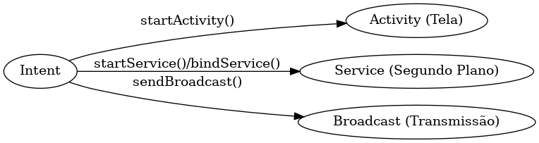

# App: Dados 6 Faces Sorteio

Solução da Atividade para a Disciplina Programação para Dispositivos Moveis I. O projeto busca implementar o clean architeture bem como um novo conhecimento com links de pesquisas para aprofundar mais sobre o aprendizado.

# Aprendizado

### O que é um Intent?
Um intent é um componente que serve para realizar uma chamada de outro componente. Conforme pode ser detalhado na documentação, um intent pode 3 casos de uso:
1. Activity: Este representa uma tela, assim o intent transfere o conteúdo para o startActivity() 
2. Service: Este opera sem uma interface, dessa forma o intent envia o contexto para o bindService()
3. Transmissão: Este envia para qualquer app.

O componente Intent ainda tem mais tipos, tais como:

- i) Explícitos:  informa o nome do componente que irá receber quando for chamado. Seu uso é recomendado para dentro do próprio app. Normalmente usados em Activity.
- ii) Implícitos: não possui o nome do componente que irá recebê-lo, apenas contém a ação. Compartilhar com outro app ou ainda abrir um link de navegador.

### Filtro do intent
O Intent pode possuir um filtro dentro do manifest do projeto/arquivo. Este serve para especificar o tipo esperado para ser recebido. Este é muito importante no intent implícito.

### Fluxograma Exemplo

## Links Úteis:
Documentação
- [Documentação Android](https://developer.android.com/guide/components/intents-filters?hl=pt-br)